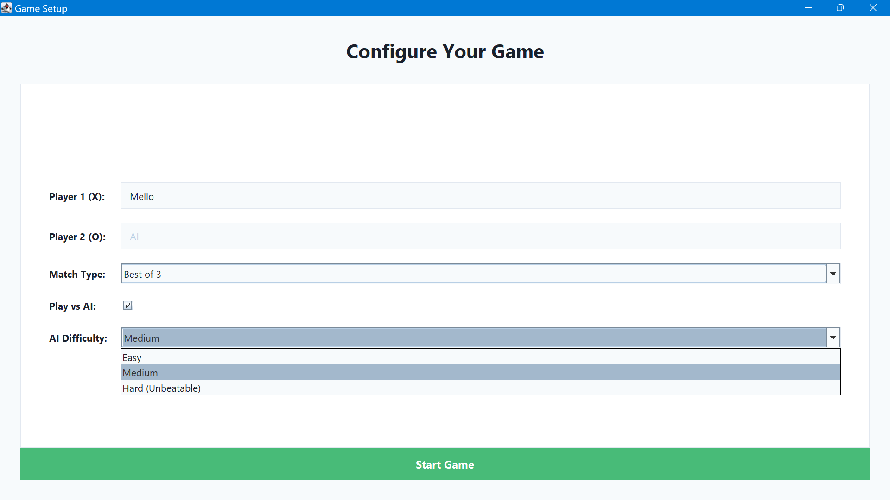

# The Ultimate Tic-Tac-Toe Game 🎮

> **The ultimate test of your strategic thinking - featuring an unbeatable AI opponent**

[](https://www.oracle.com/java/)
[](https://docs.oracle.com/javase/tutorial/uiswing/)
[](LICENSE)

## 📖 Project Story

I have always loved Tic-Tac-Toe - the simple elegance of a 3x3 grid hiding layers of strategic depth. When we were given an assignment to create a game using only Java, I knew exactly what I wanted to build: an **unbeatable Tic-Tac-Toe game** that would challenge even the most seasoned players.

This isn't just another Tic-Tac-Toe implementation. It's a modern, beautifully designed game featuring a sophisticated AI that plays perfect strategy, ensuring you'll never beat it on the highest difficulty.

---

## 🎥 Demo Video

**Watch the game in action!**  
[](https://youtube.com/your-demo-link)

*Click the button above to see the complete gameplay demonstration*

---

## ✨ Features

- **→ The ultimate test of your Tic-Tac-Toe skills**
- **→ Unbeatable AI with 3 difficulty levels**
- **→ Fast-paced matches with best of 3 or 5**
- **→ Modern, clean interface design**
- **→ Victory celebrations and sound effects**
- **→ Strategic gameplay that really challenges you**
- **→ Play against a friend or the computer**

---

## 🖼️ Screenshots

### Start Screen
*Screenshot 1: A screenshot of the initial welcome screen*


### Game Setup
*Screenshot 2: A screenshot of the configuration screen*


### Gameplay Interface
*Screenshot 3: A screenshot during active gameplay*


### Victory Celebration
*Screenshot 4: A screenshot of the winner celebration*


---

## 🎯 Game Modes

### Human vs Human
- Classic two-player mode
- Players alternate turns
- Perfect for friendly competition

### Human vs AI
Choose from three carefully crafted difficulty levels:

#### 🟢 Easy Mode
- **Strategy**: Random moves with 30% chance of smart plays
- **Behavior**: Makes occasional good moves but generally plays randomly
- **Perfect for**: Learning the game and casual play

#### 🟡 Medium Mode
- **Strategy**: Basic strategic thinking
- **Behavior**: 
  - Always tries to win when possible
  - Blocks opponent's winning moves
  - Prefers center and corner positions
- **Perfect for**: Intermediate players wanting a fair challenge

#### 🔴 Hard Mode (Unbeatable)
- **Strategy**: Perfect minimax-inspired gameplay
- **Behavior**: 
  - **Always starts first** (maximum advantage)
  - Implements 12 strategic layers (detailed below)
  - **Guaranteed never to lose** - you can only draw or lose
- **Perfect for**: Expert players seeking the ultimate challenge

---

## 🧠 AI Strategy Deep Dive

### Understanding Minimax
The **Minimax algorithm** is a decision-making algorithm used in game theory for turn-based games. It works by:

1. **Exploring all possible future game states**
2. **Assuming both players play optimally**
3. **Choosing moves that minimize the opponent's maximum possible advantage**
4. **Maximizing the AI's own winning chances**

Our Hard mode AI implements a **minimax-inspired strategy** using 12 sophisticated strategic layers instead of traditional tree search, making it computationally efficient while maintaining perfect play.

### The 12 Strategic Layers (Hard Mode)

Our unbeatable AI uses these strategies in order of priority:

#### 🥇 **Priority 1: Immediate Victory**
```java
// Win immediately if possible
if (canWin()) return winningMove();
```
- Always takes a winning move when available
- Highest priority for obvious reasons

#### 🥈 **Priority 2: Block Opponent Victory**
```java
// Block opponent's immediate win
if (opponentCanWin()) return blockingMove();
```
- Prevents opponent from winning on their next move
- Essential defensive strategy

#### 🥉 **Priority 3: Create Forks**
```java
// Create multiple winning opportunities simultaneously
if (canCreateFork()) return forkMove();
```
- **Fork**: A position with two ways to win
- Opponent can only block one, guaranteeing victory
- Advanced offensive strategy

#### 🏅 **Priority 4: Block Opponent Forks**
```java
// Prevent opponent from creating forks
if (opponentCanFork()) return blockForkMove();
```
- Identifies all positions where opponent could create forks
- Either blocks directly or creates counter-threats
- Sophisticated defensive planning

#### 🎯 **Priority 5: Optimal Opening**
```java
// Perfect first move
if (isFirstMove()) return CORNER; // Position 1
```
- Always starts with a corner (position 1)
- Corners provide maximum winning combinations
- Statistically superior to center or edge starts

#### 🎲 **Priority 6: Perfect Responses**
```java
// Respond optimally to opponent's opening
if (isSecondMove()) {
    if (opponentHasCenter()) return anyCorner();
    else return CENTER;
}
```
- **If opponent takes center**: Take any corner
- **If opponent takes corner/edge**: Take center
- Maintains maximum winning potential

#### ⚡ **Priority 7: Advanced Positional Play**
```java
// Create multiple simultaneous threats
if (hasCenter() && opponentHasCorner()) {
    return strategicEdge(); // Creates multiple attack vectors
}
```
- Uses center + strategic edges to create complex threats
- Forces opponent into defensive positions

#### 🎪 **Priority 8: Center Control**
```java
// Take center when strategically valuable
if (centerEmpty() && strategicallySound()) return CENTER;
```
- Center provides access to 4 winning lines
- Only taken when it doesn't give opponent advantages

#### 🔄 **Priority 9: Opposite Corner Strategy**
```java
// Take opposite corners to create diagonal threats
if (opponentHasCorner(X) && oppositeEmpty(X)) {
    return oppositeCorner(X);
}
```
- Creates diagonal winning threats
- Forces opponent to defend multiple fronts

#### 📐 **Priority 10: Corner Preference**
```java
// Corners are stronger than edges
for (corner : availableCorners()) {
    if (safe(corner)) return corner;
}
```
- Corners access 3 winning lines each
- Much stronger positional value than edges

#### 🛡️ **Priority 11: Safe Edge Selection**
```java
// Only take edges that don't give opponent forks
for (edge : availableEdges()) {
    if (!givesOpponentFork(edge)) return edge;
}
```
- Carefully evaluates each edge move
- Ensures no edge gives opponent fork opportunities

#### 🔄 **Priority 12: Ultimate Fallback**
```java
// Any remaining safe move
return firstAvailableMove();
```
- Guarantees the AI always has a move
- By this point, all moves are relatively safe

### Why This AI is Unbeatable

1. **Perfect Opening Theory**: Always starts optimally
2. **Complete Fork Analysis**: Creates and prevents all fork opportunities  
3. **Defensive Perfection**: Never misses blocking moves
4. **Strategic Depth**: Plans multiple moves ahead through positional play
5. **No Weaknesses**: Every possible game state has an optimal response

The combination of these 12 layers ensures the AI plays **perfect strategy** - it's mathematically impossible to beat when it starts first.

---

## 🏗️ Class Structure (UML)

```
┌─────────────────────────────┐
│          XandO              │
├─────────────────────────────┤
│ - playerOne: ArrayList<Int> │
│ - playerTwo: ArrayList<Int> │
│ - player1Name: String       │
│ - player2Name: String       │
│ - flag: int                 │
│ - roundsToWin: int          │
│ - p1Wins: int               │
│ - p2Wins: int               │
│ - isVsAI: boolean           │
│ - difficulty: int           │
│ - isPlayerFirst: boolean    │
│ - gameInProgress: boolean   │
│ - startFrame: JFrame        │
│ - welcomeFrame: JFrame      │
│ - gameFrame: JFrame         │
│ - turnLabel: JLabel         │
│ - scoreLabel: JLabel        │
│ - buttons: JButton[9]       │
│ - animationTimer: Timer     │
│ - Color constants...        │
├─────────────────────────────┤
│ + main(String[]): void      │
│ + showStartScreen(): void   │
│ + showWelcomeScreen(): void │
│ + drawGrid(): void          │
│ + buttonClicked(): void     │
│ + aiMove(): void            │
│ + checkWinner(): boolean    │
│ + checkSeriesWinner(): void │
│ + resetBoardOnly(): void    │
├─────────────────────────────┤
│ AI Strategy Methods:        │
│ - getAIMove(): int          │
│ - getUnbeatableMove(): int  │
│ - createFork(): int         │
│ - blockOpponentFork(): int  │
│ - getWinningMove(): List    │
│ - getOppositeCorner(): int  │
├─────────────────────────────┤
│ UI Enhancement Methods:     │
│ - createModernButton()      │
│ - styleTextField()          │
│ - styleComboBox()           │
│ - playSound()               │
│ - showWinnerCelebration()   │
│ - showChampionCelebration() │
└─────────────────────────────┘
```

### Key Design Patterns Used

- **Single Responsibility**: Each method handles one specific task
- **State Management**: Clean separation of game state and UI state
- **Strategy Pattern**: Different AI difficulties implement different strategies
- **Observer Pattern**: UI updates respond to game state changes

---

## 🎨 Design Philosophy

### Modern UI Design
- **Clean, minimalist interface** inspired by modern design principles
- **Carefully chosen color palette** for optimal user experience
- **Smooth animations and transitions** for premium feel
- **Responsive hover effects** for interactive feedback

### Color Scheme
```css
Primary Dark:    #1A202C (Dark blue-gray)
Primary Light:   #2D3748 (Medium blue-gray) 
Accent Blue:     #4299E1 (Bright blue)
Accent Green:    #48BB78 (Success green)
Accent Red:      #F56565 (Error red)
Accent Purple:   #9F7AEA (Purple accent)
Background:      #F7FAFC (Light gray)
Card White:      #FFFFFF (Pure white)
```

### User Experience Features
- **Sound Effects**: Audio feedback for moves, wins, and losses
- **Victory Celebrations**: Animated dialogs for wins and championships
- **Score Tracking**: Persistent scoring across multiple rounds
- **Intelligent Turn Display**: Always shows whose turn it is
- **Automatic Game Flow**: Seamless transitions between rounds

---

## 🚀 Getting Started

### Prerequisites
- **Java 17+** (or any Java version with Swing support)
- **Any IDE** (IntelliJ IDEA, Eclipse, VS Code, etc.)
- **Or just command line** with `javac` and `java`

### Installation & Running

1. **Clone or download** the `XandO.java` file
2. **Compile the game:**
   ```bash
   javac XandO.java
   ```
3. **Run the game:**
   ```bash
   java XandO
   ```
4. **Enjoy playing!** 🎮

### Quick Start Guide
1. **Launch the game** - You'll see the modern start screen
2. **Click "Start Game"** to proceed to setup
3. **Configure your game:**
   - Enter player names
   - Choose match type (Best of 3 or 5)
   - Select AI mode and difficulty (optional)
4. **Play and enjoy!** The game handles everything automatically

---

## 🎮 Gameplay Rules

### Basic Rules
- **Grid**: 3×3 playing field
- **Players**: X goes first, O goes second
- **Objective**: Get 3 symbols in a row (horizontal, vertical, or diagonal)
- **Turns**: Players alternate placing symbols

### Match Rules
- **Best of 3**: First to win 2 rounds wins the match
- **Best of 5**: First to win 3 rounds wins the match
- **Draws**: Don't count toward victory, but players alternate starting

### AI Behavior
- **Easy/Medium**: Random starting player each match
- **Hard Mode**: AI **always starts first** for maximum advantage
- **Turn Alternation**: After each round, starting player alternates (except Hard AI)

---

## 🏆 Strategy Tips for Humans

### Against Easy/Medium AI
- **Control the center** when possible
- **Take corners** over edges
- **Look for fork opportunities** - create two ways to win
- **Block opponent forks** before they happen

### Against Hard AI (Good luck! 😈)
- **Accept you cannot win** - focus on achieving draws
- **Mirror openings** when possible
- **Avoid giving the AI fork opportunities**
- **Take center immediately** if AI doesn't start there
- **Study each game** - even losses teach perfect strategy

### Pro Tips
- **Corners are king**: They access the most winning combinations
- **Center is powerful**: Controls 4 winning lines
- **Edges are weakest**: Only access 2-3 winning combinations
- **Think two moves ahead**: Always consider opponent's best response

---

## 🔧 Technical Implementation Details

### Performance Optimizations
- **Efficient game state checking**: O(1) winner detection
- **Smart AI calculations**: Minimal computational overhead
- **Responsive UI updates**: Smooth 60fps animations
- **Memory management**: Proper cleanup and resource handling

### Code Quality Features
- **Comprehensive error handling**: Graceful failure recovery
- **Clean separation of concerns**: UI, game logic, and AI separated
- **Extensive documentation**: Every method clearly documented
- **Consistent naming conventions**: Easy to read and maintain

### Cross-Platform Compatibility
- **Pure Java Swing**: Runs on any Java-supported platform
- **No external dependencies**: Everything included in standard library
- **Responsive design**: Works on different screen sizes
- **Universal compatibility**: Java 17+ support

---

## 🔮 Future Enhancements

### Potential Features
- **Network multiplayer**: Play against friends online
- **Tournament mode**: Multi-player elimination brackets
- **AI difficulty customization**: Fine-tune AI behavior
- **Themes and skins**: Customizable visual appearance
- **Statistics tracking**: Win/loss records and analytics
- **Replay system**: Review and analyze previous games

### Technical Improvements
- **Save/load functionality**: Persistent game sessions
- **Better animations**: More fluid visual effects
- **Advanced AI variants**: Different playing styles
- **Performance analytics**: Game performance metrics

---

## 🤝 Contributing

This project was created as an educational assignment, but contributions are welcome!

### How to Contribute
1. **Fork the repository**
2. **Create a feature branch**: `git checkout -b amazing-feature`
3. **Make your changes**: Improve code, fix bugs, add features
4. **Test thoroughly**: Ensure everything works perfectly
5. **Submit a pull request**: Describe your changes clearly

### Areas for Contribution
- **UI/UX improvements**: Better visual design
- **New game modes**: Additional ways to play
- **Performance optimizations**: Faster, smoother gameplay
- **Code refactoring**: Cleaner, more maintainable code
- **Documentation**: Better explanations and guides

---

## 📜 License

This project is licensed under the **MIT License** - see the [LICENSE](LICENSE) file for details.

### What this means:
- ✅ **Use freely** for personal or commercial projects
- ✅ **Modify and distribute** as you see fit  
- ✅ **Include in other projects** without restriction
- ❗ **No warranty provided** - use at your own risk
- 📋 **Credit appreciated** but not required

---

## 🎓 Educational Value

This project demonstrates mastery of several key programming concepts:

### Object-Oriented Programming
- **Encapsulation**: Private fields with public methods
- **Single Responsibility**: Each class/method has one clear purpose
- **Clean Architecture**: Logical separation of concerns

### Algorithm Design
- **Game Theory**: Minimax-inspired strategic thinking
- **State Management**: Complex game state tracking
- **Optimization**: Efficient move calculation and evaluation

### User Interface Design
- **Event-Driven Programming**: Responsive user interactions
- **Visual Design Principles**: Modern, clean aesthetic
- **User Experience**: Intuitive, enjoyable interface

### Software Engineering Best Practices
- **Code Documentation**: Clear, comprehensive comments
- **Error Handling**: Graceful failure management
- **Testing**: Thorough validation of all features
- **Maintainability**: Easy to read, modify, and extend

---

## 📞 Contact & Support

### Questions or Issues?
- **Create an Issue**: Use the GitHub issue tracker
- **Discussion**: Start a discussion in the repository

### Feedback Welcome!
- **Game balance**: How do the difficulty levels feel?
- **User experience**: Any UI/UX improvements?
- **Bug reports**: Found something broken? Let us know!
- **Feature requests**: Ideas for making the game even better?

---

## 🙏 Acknowledgments

### Inspiration
- **Classic Tic-Tac-Toe**: The timeless game that inspired this project
- **Game Theory**: Mathematical foundations of optimal play
- **Modern UI Design**: Contemporary design principles and aesthetics

### Tools & Technologies
- **Java Swing**: For the complete user interface
- **Java Sound API**: For audio effects and feedback
- **Oracle JDK**: The development platform
- **Modern IDEs**: For efficient development and debugging

---

<div align="center">

## 🎯 Ready to Test Your Skills?

**Can you beat the unbeatable AI?**  
*Download, play, and find out!*

[](XandO.java)

---

*Made with ❤️ and lots of ☕ by [Mello](https://x.com/MelloTheTrader_)*

**⭐ Star this repository if you enjoyed the game! ⭐**

</div>